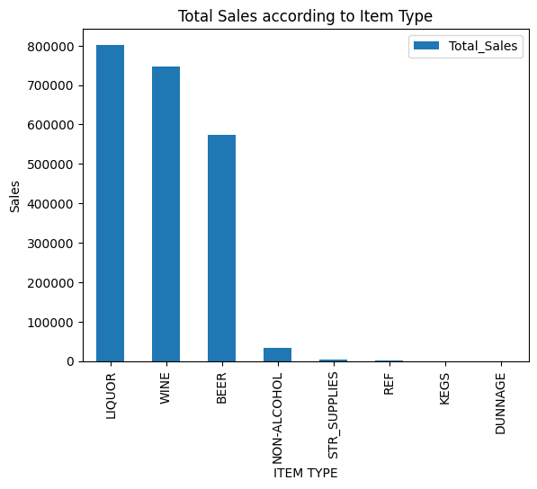
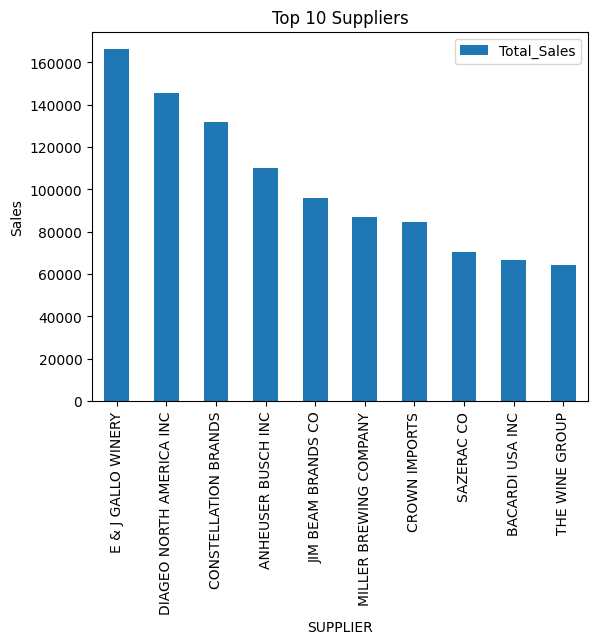
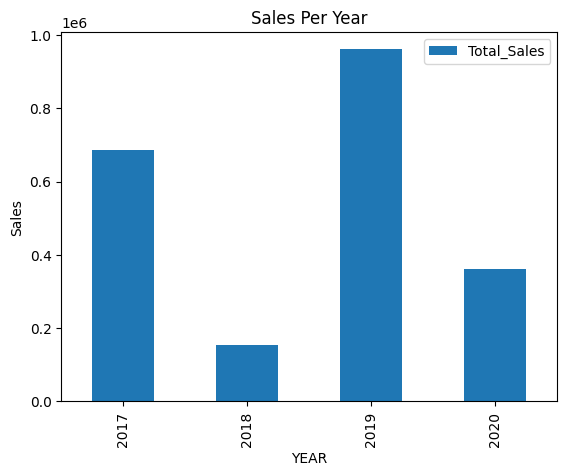
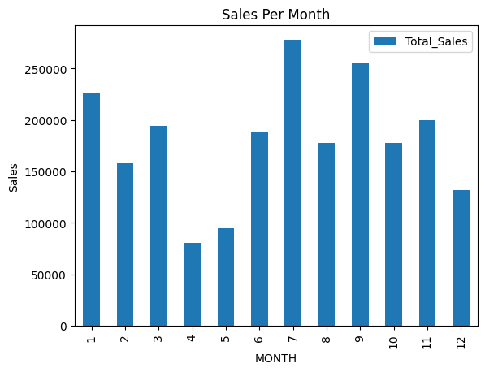
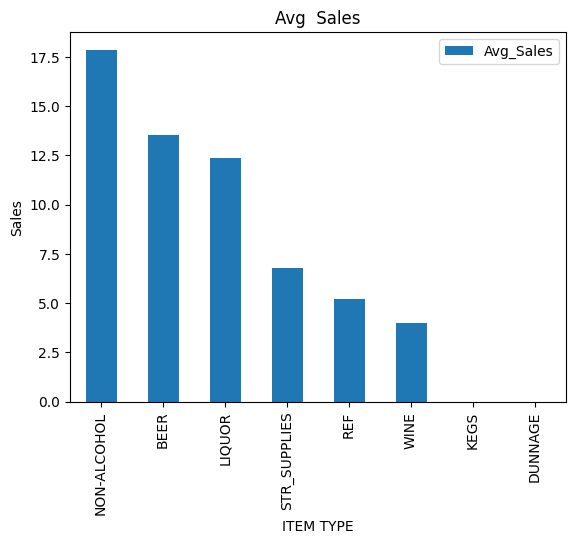
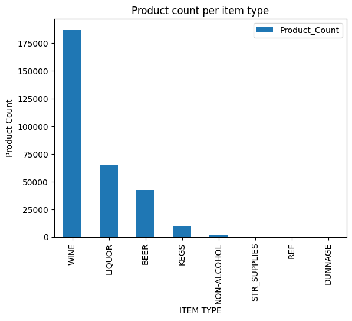
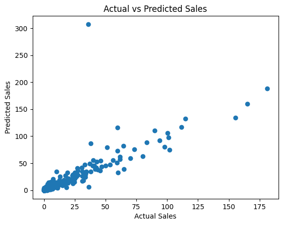

# Retail Sales Analysis and Prediction

A data analytics and machine learning project that analyzes retail sales patterns using SQL and Python, and predicts retail sales using a Random Forest regression model.

The model achieves an **R² score of 0.896**, demonstrating strong predictive performance.

---

## 📌 Project Overview

This project focuses on analyzing retail sales data and building a machine learning model to predict sales based on product, supplier, and transaction-level features.

It includes:
- Data cleaning and preprocessing
- SQL-based exploratory analysis
- Data visualization for business insights
- Machine learning model building and evaluation

---

## 📊 Dataset Information

The dataset includes the following features:

- Year, Month
- Supplier
- Item Code, Item Description
- Item Type
- Retail Sales
- Retail Transfers
- Warehouse Sales

---

## 🛠 Tools & Technologies

- Python
- Pandas
- NumPy
- SQLite / SQL
- Matplotlib / Seaborn
- Scikit-learn
- Jupyter Notebook

---

## 🔄 Project Workflow

### 1. Data Cleaning
- Handled missing values
- Removed duplicates
- Performed outlier analysis

### 2. SQL Analysis
- Grouped sales by item type
- Analyzed supplier performance
- Studied monthly sales trends

### 3. Feature Engineering
- Encoded categorical variables
- Prepared dataset for ML model

### 4. Model Building
- Random Forest Regressor used for prediction

### 5. Model Evaluation
- R² Score: **0.896**
- Mean Absolute Error (MAE): **1.60**

---

## 📈 Key Insights

- Retail Transfers are the most influential feature for predicting sales
- Certain item types generate significantly higher revenue
- Supplier contribution is highly uneven across the dataset
- Sales show seasonal variation across months

---

## 📊 Visualizations

### 1. Sales by Item Type


Liquor and Wine are the top revenue-generating categories, while KEGS and DUNNAGE contribute the least.

---

### 2. Top 10 Suppliers


A small number of suppliers contribute most of the total sales, indicating supplier concentration.

---

### 3. Sales per Year


Sales peaked in 2019, showing strong yearly variation in performance.

---

### 4. Sales per Month


Sales show seasonal trends, with higher performance in mid-year months.

---

### 5. Average Sales per Item Type


Non-alcohol categories show higher average sales per transaction, while wine dominates in total volume.

---

### 6. Product Count per Item Type


Wine has the highest product variety, indicating a wide product range in this category.

---

### 7. Actual vs Predicted Sales


The Random Forest model predictions closely follow actual values, showing strong performance with only a few outliers.

---

## ▶ How to Run the Project

```bash
git clone <repo-link>
cd retail-sales-analysis
pip install -r requirements.txt
jupyter notebook